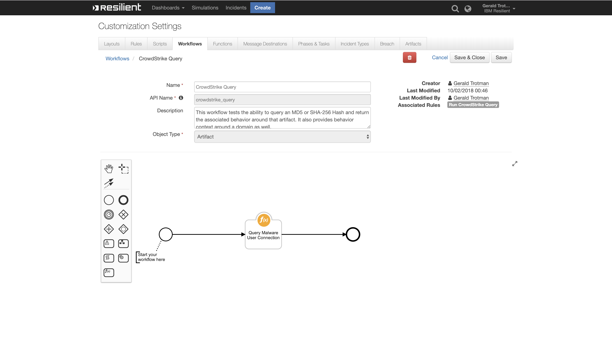

# Resilient Integration with CrowdStrike
**This package contains one function that allows you to pull back event results from MD5 Hashes, SHA-256 Hashes, and Domain Artifact Searches.**





## app.config Settings:
```python
[fn_crowdstrike_query]
user_name=crowdstrike_usermane
api_key=crowdstrike_password
```

## Function Inputs:
| Input Name | Type | Required | Example |
| ------------- | :--: | :-------:| ------- |
| `incident_id` | `Number` | Yes | `2114` |
| `artifact_type` | `String` | Yes | `Malware SHA-256 Hash` |
| `artifact_value` | `String` | Yes | `B447AC311CA15E7FECFE372208C513FB370BA8A1EA85ADF16B56E6D5B45DE6A7` |


## Function Output:
```python
results = {
    "errors": [], 
    "meta": {
        "powered_by": "msa-api", 
        "query_time": 0.007317822, 
        "trace_id": "c9ccee42-7553-4166-afa7-6086b41d9bb8"
    }, 
    "resources": [
        {
            "behaviors": [
                {
                    "alleged_filetype": "exe", 
                    "behavior_id": "5302", 
                    "cmdline": "\"C:\\Users\\gt\\AppData\\Local\\Temp\\Temp1_this_does_nothing_v1.zip\\this_does_nothing.exe\" ", 
                    "confidence": 100, 
                    "control_graph_id": "ctg:e13405ef4e0c4f3340df3a18ba7da4ae:1151102", 
                    "device_id": "e13405ef4e0c4f3340df3a18ba7da4ae", 
                    "filename": "this_does_nothing.exe", 
                    "ioc_description": "", 
                    "ioc_source": "source", 
                    "ioc_type": "hash_sha256", 
                    "ioc_value": "4e106c973f28acfc4461caec3179319e784afa9cd939e3eda41ee7426e60989f", 
                    "md5": "ba4a1ebcf10a8602bfff43c83f11621a", 
                    "objective": "Falcon Detection Method", 
                    "parent_details": {
                        "parent_cmdline": "C:\\Windows\\Explorer.EXE", 
                        "parent_md5": "", 
                        "parent_process_graph_id": "pid:e13405ef4e0c4f3340df3a18ba7da4ae:9029168", 
                        "parent_sha256": "6a671b92a69755de6fd063fcbe4ba926d83b49f78c42dbaeed8cdb6bbc57576a"
                    }, 
                    "pattern_disposition": 0, 
                    "pattern_disposition_details": {
                        "detect": false, 
                        "inddet_mask": false, 
                        "indicator": false, 
                        "kill_parent": false, 
                        "kill_process": false, 
                        "kill_subprocess": false, 
                        "operation_blocked": false, 
                        "policy_disabled": false, 
                        "process_blocked": false, 
                        "quarantine_file": false, 
                        "quarantine_machine": false, 
                        "rooting": false, 
                        "sensor_only": false
                    }, 
                    "scenario": "intel_detection", 
                    "severity": 50, 
                    "sha256": "4e106c973f28acfc4461caec3179319e784afa9cd939e3eda41ee7426e60989f", 
                    "tactic": "Custom Intelligence", 
                    "technique": "Indicator of Compromise", 
                    "timestamp": "2018-09-24T22:24:32Z", 
                    "triggering_process_graph_id": "pid:e13405ef4e0c4f3340df3a18ba7da4ae:116768391", 
                    "user_id": "S-1-5-21-1373934185-2132145677-1073019022-1000", 
                    "user_name": "gt"
                }, 
                {
                    "alleged_filetype": "exe", 
                    "behavior_id": "5302", 
                    "cmdline": "C:\\Windows\\Explorer.EXE", 
                    "confidence": 100, 
                    "control_graph_id": "ctg:e13405ef4e0c4f3340df3a18ba7da4ae:1151102", 
                    "device_id": "e13405ef4e0c4f3340df3a18ba7da4ae", 
                    "filename": "explorer.exe", 
                    "ioc_description": "", 
                    "ioc_source": "source", 
                    "ioc_type": "hash_sha256", 
                    "ioc_value": "4e106c973f28acfc4461caec3179319e784afa9cd939e3eda41ee7426e60989f", 
                    "md5": "", 
                    "objective": "Falcon Detection Method", 
                    "parent_details": {
                        "parent_cmdline": "", 
                        "parent_md5": "", 
                        "parent_process_graph_id": "", 
                        "parent_sha256": ""
                    }, 
                    "pattern_disposition": 0, 
                    "pattern_disposition_details": {
                        "detect": false, 
                        "inddet_mask": false, 
                        "indicator": false, 
                        "kill_parent": false, 
                        "kill_process": false, 
                        "kill_subprocess": false, 
                        "operation_blocked": false, 
                        "policy_disabled": false, 
                        "process_blocked": false, 
                        "quarantine_file": false, 
                        "quarantine_machine": false, 
                        "rooting": false, 
                        "sensor_only": false
                    }, 
                    "scenario": "intel_detection", 
                    "severity": 50, 
                    "sha256": "6a671b92a69755de6fd063fcbe4ba926d83b49f78c42dbaeed8cdb6bbc57576a", 
                    "tactic": "Custom Intelligence", 
                    "technique": "Indicator of Compromise", 
                    "timestamp": "2018-09-24T22:46:18Z", 
                    "triggering_process_graph_id": "pid:e13405ef4e0c4f3340df3a18ba7da4ae:9029168", 
                    "user_id": "S-1-5-21-1373934185-2132145677-1073019022-1000", 
                    "user_name": "gt"
                }
            ], 
            "cid": "b1e43228990c4bfe8e979969d955b800", 
            "created_timestamp": "2018-09-24T22:24:32Z", 
            "detection_id": "ldt:e13405ef4e0c4f3340df3a18ba7da4ae:1151102", 
            "device": {
                "agent_load_flags": "0", 
                "agent_local_time": "2018-09-24T18:09:27.783Z", 
                "agent_version": "4.12.7504.0", 
                "bios_manufacturer": "Phoenix Technologies LTD", 
                "bios_version": "6.00", 
                "cid": "b1e43228990c4bfe8e979969d955b800", 
                "config_id_base": "65994753", 
                "config_id_build": "7504", 
                "config_id_platform": "3", 
                "device_id": "e13405ef4e0c4f3340df3a18ba7da4ae", 
                "external_ip": "129.42.208.182", 
                "first_seen": "2018-09-24T22:05:42Z", 
                "hostname": "GT-CROWDSTRIKE", 
                "last_seen": "2018-09-24T22:21:37Z", 
                "local_ip": "9.70.247.86", 
                "mac_address": "00-0c-29-aa-6e-c3", 
                "major_version": "6", 
                "minor_version": "1", 
                "modified_timestamp": "2018-09-24T22:23:38Z", 
                "os_version": "Windows 7", 
                "platform_id": "0", 
                "platform_name": "Windows", 
                "product_type": "1", 
                "product_type_desc": "Workstation", 
                "status": "normal", 
                "system_manufacturer": "VMware, Inc.", 
                "system_product_name": "VMware Virtual Platform"
            }, 
            "email_sent": true, 
            "first_behavior": "2018-09-24T22:24:32Z", 
            "hostinfo": {
                "domain": ""
            }, 
            "last_behavior": "2018-09-24T22:46:18Z", 
            "max_confidence": 100, 
            "max_severity": 50, 
            "max_severity_displayname": "Medium", 
            "seconds_to_resolved": 0, 
            "seconds_to_triaged": 0, 
            "show_in_ui": true, 
            "status": "new"
        }
    ]
}

```

## Pre-Process Script:
This example sets the search value **to the value of the Incident's Artifact.**
```python
# Sets the corresponding needed values
inputs.incident_id = incident.id
inputs.artifact_type = artifact.type
inputs.artifact_value = artifact.value
```

## Post-Process Script:
This example simply returns the results as a string and **adds Notes to the Incident.**
```python
incident.addNote(results.value)
```

## Rules
| Rule Name | Object Type | Workflow Triggered | Conditions |
| --------- | :---------: | ------------------ | ---------- |
| Run CrowdStrike Query | `Artifact` | `CrowdStrike Query` | `Type` is equal to `Malware SHA-256 Hash`, `Malware MD5 Hash` or `DNS Name`

